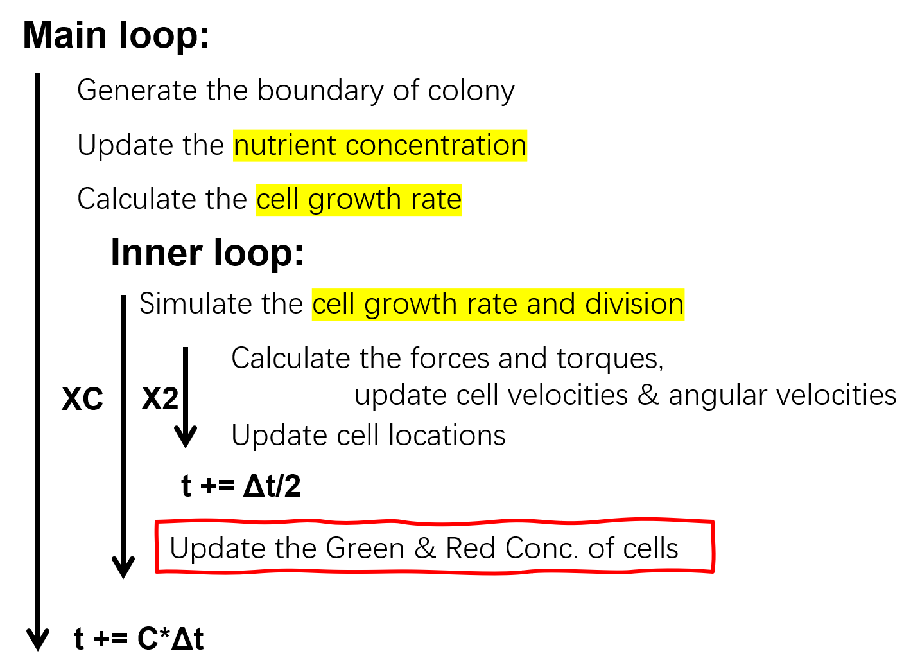

# README file
CHU Pan revised @ SIAT\
SUN Hui provided the source code.\
MIT Licence

This code is based on the work that published in $Elife$.

> Warren, M. R. *et al.* Spatiotemporal establishment of dense bacterial colonies growing on hard agar. *Elife* **8**, e41093 (2019).  

### How to compile and run the cpp code?

   (1) compile the code:\
   `$> cd run_sim`\
   `$> g++ ../*.cpp -fopenmp -O3 -o [file name]`\
   (2) run the code: \
   `$> [file name] [parameter file] [core number] /Direcotry/To/Output/Folder [field file output flag] > /Redirect/Console/Output &`\
   The command line argument `[parameter file]` is the input txt file. \
   The command line argument `[core number]` means we run this code using how much cores. You can change it to some other numbers. \
   The command line argument `[field file output flag]` means whether outputing filed data, if set `0`, we will disable field data out put. \
   The command line argument `/Direcotry/To/Output/Folder` is the directory to output the data. \
   The command line argument `> /Redirect/Console/Output &` means console outpout gets redirected to `/Redirect/Console/Output`, and the program runs in background.\
   **Note:** When perform long-term simulation, specially, time limit is extended to more than 12 hrs. The lineage files can be more than 100 Giga bits. Make sure that there is sufficient free disk space left.

### A fast way to run the code.

   We provide an easy way to compile and run the code with the help of `python` script. \
   `$> python CellMD3D_compile_run.py -n [path for compiled file] -i [path for parameter file] -o [directory for output files]  --core_num [core number]`

### Data output description

   `Cells`: containing `.txt` files that recording the cells' info;\
   The output format has been defined in `InputOutput.cpp`.

   >t, ID, cell.Type, cell.Position.p.x, cell.Position.p.y, cell.Position.p.z, cell.Position.q.x, cell.Position.q.y, cell.Position.q.z, cell.Length, T.xx, T.yy, T.zz, cell.Velocity.x, cell.Velocity.y, cell.Velocity.z, cell.GrowthRate, cell.DynFric.x, cell.DynFric.y, cell.DynFric.z, cell.StaFric.x, cell.StaFric.y, cell.StaFric.z, cell.Position.time_p, cell.Position.time_q, cell.Position.age_p, cell.Position.age_q, cell.Ancestor, cell.G, cell.R\
   >0.4002 0 1 1.0151 2.8463 0.4718 0.0211 0.2836 0.4718 2.7487 0.0000 0.0000E+00 0.0000E+00 4.9329E-15 1.2738E-14 1.2576E+00 1.5140E+00 0.0000 0.0000 0.0000 0.0000 0.0000 0.0000 0.0000 0.0000 0 0 1 3.8623 4.6081

| t      | ID   | Type | p                    | q                    | Length | Tensor                       | Velocity                         | Growth Rate | DynFric              | StaFric              | time_p | time_q | age_p | age_q | Ancestor | G      | R      |
| ------ | ---- | ---- | -------------------- | -------------------- | ------ | ---------------------------- | -------------------------------- | ----------- | -------------------- | -------------------- | ------ | ------ | ----- | ----- | -------- | ------ | ------ |
| 0.4002 | 0    | 1    | 1.0151 2.8463 0.4718 | 0.0211 0.2836 0.4718 | 2.7487 | 0.0000 0.0000E+00 0.0000E+00 | 4.9329E-15 1.2738E-14 1.2576E+00 | 1.5140E+00  | 0.0000 0.0000 0.0000 | 0.0000 0.0000 0.0000 | 0.0000 | 0.0000 | 0     | 0     | 1        | 3.8623 | 4.6081 |

   The position of cells was described by a sphero-cylinder model, `p` and `q` characterize the two centers of the two hemispheres.
   Notice, the radius of cells, i.e. the radius of the two hemispheres, is defined in `Constants.cpp` and the unit is microns.

### Toggle Switch

The toggle switch within cells was defined in file `integrate.cpp`, `updateToggle` function is used for update the state of the toggle.
$$
\dot{G} = \alpha_G \cdot H_{G}(R) - \lambda \cdot G \\
\dot{R} = \alpha_R \cdot H_{R}(G) - \lambda \cdot R \
$$

#### Reactions for SSA

$$
\O \overset{\alpha_G \cdot H_{G}(R) }{\rightarrow} G \\
\O \overset{\alpha_R \cdot H_{R}(G) }{\rightarrow} R \\
G \overset{\lambda G}{\rightarrow} \O \\
R \overset{\lambda R}{\rightarrow} \O
$$


### Growth

$$
\pmb{\lambda}(\pmb{r}, t) = \lambda_s \frac{\pmb{C}(\pmb{r}, t)}{\pmb{C}(\pmb{r}, t) + K_s}
$$

$$
V_{cell}= \frac{1}{4} \pi w_0^2 l + \frac{1}{6} \pi w_0^3, M_{cell}=\rho_{cell}V_{cell}
$$

$$
\dot l = \tilde{\lambda} l
$$

$$
l_1 = \frac{1}{2} l_{div} - \frac{w_0}{2} + \eta l_{rand}, l_2 = \frac{1}{2} l_{div} - \frac{w_0}{2} - \eta l_{rand},
$$

$$
t_d = \frac{\ln 2}{\lambda}, l_{div} = l_0 \exp( \tilde{\lambda} t_d)
$$

$$
\frac{\tilde{\lambda}}{\lambda} = \sigma = \frac{\ln(2 l_{div} / (l_{div} - w_0))}{\ln 2}
$$

Note: $w_0$ is the **diameter** of the hemisphere. 

### Algorithm



### Functions API

`UpdateEnvArray`: Update the nutrient concentration


### Console

`s0`: Calculate the field, nutrient conc.\
`s1`: Calculate forces and move cells\
`s2`: Output fields,cells,density\
`s3`: Cell division\
`s4`: switch cells location between olds and news \
`s00`: get colony height

### Change log

8/2/2022
* the code can be compiled under windows platform;\
   **Note**: When running codes in Windows platform may incur \
   `terminate called after throwing an instance of 'std::bad_alloc'
   what():  std::bad_alloc` \
* Create the lineage file automatically.

8/9/2022
* The proteins in toggle have a basic decay rate `deltaP`.

8/11/2022
V0.12
* Update the toggle switch states by cell mass gowth rate, rather elongation rate;
* Add parameter `SigmaMoL` replace the fixed dividing cell aspect ratio log(3)/log(2).

10/9/2022
V0.20
* SSA version

### TODO
`/home/fulab/colony_agent_based/InputOutput.cpp: In function ‘int LoadCells(char*, Cell*, UniformGrid&, double&, double&)’:
/home/fulab/colony_agent_based/InputOutput.cpp:423:7: warning: ignoring return value of ‘size_t fread(void*, size_t, size_t, FILE*)’, declared with attribute warn_unused_result [-Wunused-result]
423 |  fread(&t, sizeof(double), 1, FID);                                                                                                                     |  ~~~~~^~~~~~~~~~~~~~~~~~~~~~~~~~~~
/home/fulab/colony_agent_based/InputOutput.cpp:424:7: warning: ignoring return value of ‘size_t fread(void*, size_t, size_t, FILE*)’, declared with attribute warn_unused_result [-Wunused-result]
424 |  fread(&dt, sizeof(double), 1, FID);                                                                                                                    |  ~~~~~^~~~~~~~~~~~~~~~~~~~~~~~~~~~~
/home/fulab/colony_agent_based/InputOutput.cpp:431:8: warning: ignoring return value of ‘size_t fread(void*, size_t, size_t, FILE*)’, declared with attribute warn_unused_result [-Wunused-result]                                                                                                                    431 |  fread (cells, sizeof(Cell), cell_count, FID);                                                                                                          |  ~~~~~~^~~~~~~~~~~~~~~~~~~~~~~~~~~~~~~~~~~~~~
/home/fulab/colony_agent_based/InputOutput.cpp: In function ‘Inputs ReadParameters(char*)’:                                                               /home/fulab/colony_agent_based/InputOutput.cpp:475:7: warning: ignoring return value of ‘size_t fread(void*, size_t, size_t, FILE*)’, declared with attribute warn_unused_result [-Wunused-result]                                                                                                                    475 |  fread(buffer, fileLen, 1, FID);
|  ~~~~~^~~~~~~~~~~~~~~~~~~~~~~~~                                                                                                                   /home/fulab/colony_agent_based/InputOutput.cpp: In function ‘void CreateOutputFileLineage(int, OutputFiles&, bool)’:
/home/fulab/colony_agent_based/InputOutput.cpp:107:36: warning: ‘%d’ directive writing between 1 and 11 bytes into a region of size between 0 and 499 [-W$/home/fulab/colony_agent_based/InputOutput.cpp: In function ‘void CreateOutputFileLineage(int, OutputFiles&, bool)’:                             [102/374]/home/fulab/colony_agent_based/InputOutput.cpp:107:36: warning: ‘%d’ directive writing between 1 and 11 bytes into a region of size between 0 and 499 [-Wformat-overflow=]
107 |     (void)sprintf(lineage_name,"%s/%d",lineage_name,OutputID);                                                                                          |                                    ^~
In file included from /usr/include/stdio.h:867,                                                                                                                            from /usr/include/c++/9/cstdio:42,
from /usr/include/c++/9/ext/string_conversions.h:43,                                                                                                      from /usr/include/c++/9/bits/basic_string.h:6496,
from /usr/include/c++/9/string:55,                                                                                                                        from /usr/include/c++/9/bits/locale_classes.h:40,
from /usr/include/c++/9/bits/ios_base.h:41,                                                                                                               from /usr/include/c++/9/ios:42,                                                                                                                           from /usr/include/c++/9/ostream:38,                                                                                                                       from /usr/include/c++/9/iostream:39,
from /home/fulab/colony_agent_based/InputOutput.h:7,                                                                                                      from /home/fulab/colony_agent_based/InputOutput.cpp:1:                                                                                   /usr/include/x86_64-linux-gnu/bits/stdio2.h:36:34: note: ‘__builtin___sprintf_chk’ output between 3 and 512 bytes into a destination of size 500             36 |   return __builtin___sprintf_chk (__s, __USE_FORTIFY_LEVEL - 1,
|          ~~~~~~~~~~~~~~~~~~~~~~~~^~~~~~~~~~~~~~~~~~~~~~~~~~~~~~                                                                                      37 |       __bos (__s), __fmt, __va_arg_pack ());
|       ~~~~~~~~~~~~~~~~~~~~~~~~~~~~~~~~~~~~~`

### BUG Reporting

* Invalid index

```
t = 11.005550, 1060805 cells;      sim time =   3:30:57;      time cost = 627.799 2.35591 626.019 24.3967 5.64741 0.000171.

Colony_V0.2.4.7: /home/fulab/PycharmProjects/colony_agent_based_SSA/tools.h:24: void MyAssert(bool, const char*): Assertion `false' failed.
Invalid index into array

Aborted (core dumped)

[CellsMD3D ssa_in23_Colony_V0.2.4.7] -> Simulation failed
```

parameters

```
t_max       15
dt          0.00005
Cdt         0.1
Box_x       64
Box_y       64
Box_z       40
Box_z_agar	16
maxLevels	4
FilterLen	5
```

Size is small?

New parameters

```
t_max       15
dt          0.00005
Cdt         0.1
Box_x       72
Box_y       72
Box_z       52
Box_z_agar	20
maxLevels	4
FilterLen	5
```

